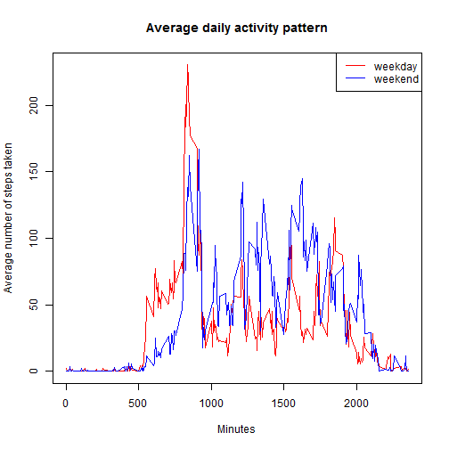

# Reproducible Research: Peer Assessment 1
==========================================

## 1. Loading and preprocessing the data

```r
unzip("activity.zip")
data <- read.csv("activity.csv",as.is=T)
```

## 2. What is mean/total number of steps taken per day?


```r
Steps <- tapply(data[,1],data[,2],sum,na.rm=T)
hist(Steps,breaks=12,main="Histogram of the total number of steps taken each day")
```

 

```r
mean <- mean(Steps)
median <- median(Steps)
```

The mean and median total number of steps taken per day is 9354.2295 and 10395, respectively.

## 3. What is the average daily activity pattern?


```r
Average5M <- tapply(data[,1],data[,3],mean,na.rm=T)
Minutes <- names(Average5M)
plot(Minutes,Average5M,type="l",ylab="Average number of steps taken")
title("Average daily activity pattern")
```

 

```r
Max <- Minutes[which.max(Average5M)]
```

The 5-minute interval containing the maximum number of steps is 835. 


## 4. Imputing missing values


```r
missings <- sum(is.na(data[,1]))
```

The total number of missing values in the dataset is 2304.

Create a new dataset that is equal to the original dataset but with the missing data filled with the mean for that 5-minute interval:


```r
data2 <- data
for (x in 1:nrow(data2)){
    if(is.na(data2[x,1])){ 
        data2[x,1] <- Average5M[ as.character(data2[x,3]) ] 
    }
}
```

The histogram of the total number of steps taken each day:


```r
StepsIM <- tapply(data2[,1],data2[,2],sum)
hist(StepsIM,breaks=12,xlab="Steps",main=NULL)
```

 

```r
mean <- mean(StepsIM)
median <- median(StepsIM)
```

The mean and median total number of steps taken per day is 1.0766 &times; 10<sup>4</sup> and 1.0766 &times; 10<sup>4</sup>, respectively.

From these results, the mean total number of steps taken per day is significantly 
improved, and the median value is comparable to the estimate from the first part 
of the assignment. It also seems that imputing missing data does have significantly 
influence on the distribution of the total daily number of steps.

## 5. Are there differences in activity patterns between weekdays and weekends?

Preparing data:


```r
# find weekdays and weekend
type <- weekdays(as.Date(data2[,2]),T)

data2weekend <- data2[type == "Sun" | type == "Sat",]
data2weekday <- data2[type != "Sun" & type != "Sat",]

Average5Mweekend <- tapply(data2weekend[,1],data2weekend[,3],mean)
Average5Mweekday <- tapply(data2weekday[,1],data2weekday[,3],mean)
```

Plotting:


```r
plot(Minutes,Average5Mweekday,type="l",col="red",ylab="Average number of steps taken")
lines(Minutes,Average5Mweekend,type="l",col="blue")
legend("topright",legend=c("weekday","weekend"),col=c("red","blue"),lty=1)
title("Average daily activity pattern")
```

 

As shown in above figure, there's signifcant differences in activity patterns between weekdays and weekends.
